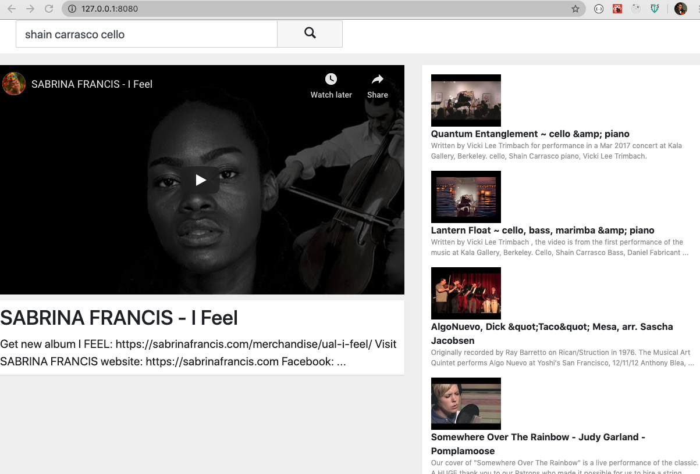

# YourTube-Redux

YourTube is a video search and display application utilizing the YouTube API

The search results are dynamically generated as each character is added to the search input - effectively auto-completing patial inputs.

This was originally an application that I designed and built the UX/UI with React.
Then I refactored/converted from React to Redux as a way to learn and practice Redux.